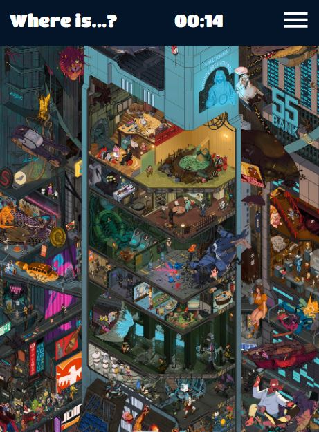
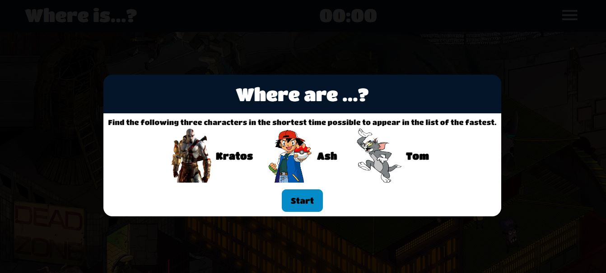

# Where is Waldo game using MongoDB, Express, React and NodeJS

## An application that saves the coordinates of the characters in a database and uses them every time the user selects a point in the game image.

This application is based on the game Where's Waldo, which consists of finding certain characters in an image full of various elements. 

  

Three characters must be found:
* Kratos from the God of War games.
* Tom from Tom and Jerry.
* Ash from Pokemon.

  

The application has a timer to measure the time it takes users to find the three characters. The accumulated time is saved in the database along with a username chosen by the player when all the characters have been found.

On the other hand, the game has responsive qualities, since the image can be adapted to different screen sizes without losing its radius of appearance. Also, the coordinates obtained by the client are converted to relative coordinates to ensure that the points in the image are always the same regardless of the size of the device.
